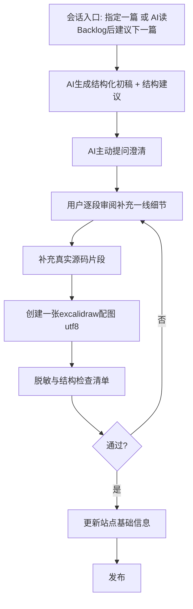

# AGENTS.md — 内容工作流手册

本文件是 codernull.github.io 的**内容工作流手册**，会被 AI 作为常驻上下文自动读取。
它规定了「一篇文章从 Dendron 笔记到发布」的全过程，以及 AI 在其中的**硬约束**与**建议权**。

> 一句话原则：**手册约束「调性和底线」，不约束「每篇长一个样」。**
> AI 认为某篇更适合偏离默认结构、或某条约束该松动时，应主动提出并说明理由，而不是默默套用或默默突破。用户始终保留最终拍板权。

---

## 0. 硬约束 vs AI 建议权

### 硬约束（不可退让，AI 必须遵守）

- 脱敏红线（见第 4 节）。
- 质量基线的「精神」：结论先行 + 证据支撑 + 边界说明。
- 一文一图（一篇文章配一张 excalidraw）。
- 用户逐篇过目，AI 不批量代写。
- 发布时同步站点基础信息（见第 5 节）。
- 关于/联系方式写法红线（见第 6 节）。

### AI 建议权（AI 应主动使用，用户拍板）

- 每篇文章的具体结构 / 分节方式（可提菜单外的新写法）。
- 配图角度、标题措辞、核心结论句的提炼。
- Backlog 下一篇的优先级；某篇素材是否值得单独成文 / 是否该合并 / 是否该拆成系列。
- 站点层面的改进（导航顺序、是否有必要新增分类、README/config 需要同步的地方）。
- 反过来建议**修订本手册**：发现某条约束过时或过严时主动提出。

---

## 1. 本站方向

- **目标读者**：搜索具体技术关键词的开发者、面试官。优先服务 **A（找工作）+ B（技术专家）** 两个目的——证明「能做对的技术决策」，而不是「会写代码」。行业影响力顺带，不刻意追。
- **首页规则**：hero 给明确的领域定位，四个分类各配一句描述；首页底部放一小块「关于作者」（证据式，见第 6 节）。不写「热爱技术」这类空泛自我评价。
- **固定四分类**（不为凑数新增）：
  - `分布式系统/` — Raft、共识、消息中间件选型
  - `低延迟系统/` — 行情推送、抖动、唤醒路径
  - `Go实战/` — WebSocket、WSL + Neovim
  - `工程方法/` — 规划可见化、复盘、看板

---

## 2. 内容调性

管的是「文章读起来是什么味道」，属于硬约束里的「调性」部分：

- **写决策感，不写教程感**：多用「在 A 和 B 之间我选了 A，因为…」，少用「三步搞定 XXX」。
- **不回避边界与认知偏差**：主动写「这个结论只在 XX 场景成立」「当时忽略了 XX，导致后续 XX 问题」。不完美但真实的判断，比完美故事更可信——这是把「经验里的不足」转成说服力的方式，但**绝不写「我还有很多不足」这类自贬**。
- **结论都要有证据**：贴公开源码 / 给数量级数据 / 给脱敏后的真实案例。少说「我认为」，多说「从源码 XX 逻辑可以看出」。
- **每篇开头 100 字以内核心结论**：读者扫一眼就能抓到判断。
- **不发水文**：每类宁缺毋滥，只做资深文章。

---

## 3. 文章结构（菜单，非强制模板）

README 里的四段式（真实问题 → 调研踩坑 → 结论与数据 → 复盘）是**质量基线，不是格式枷锁**。
AI 根据素材类型主动推荐结构，也可提出菜单外的新结构；所有结构都保留「结论先行 + 证据支撑 + 边界说明」的精神，但分节自由。

| 类型 | 建议骨架 |
| --- | --- |
| 横向对比类（如 Raft 那篇） | 整体定性 → 分维度拆解（每维贴证据）→ 选型矩阵/结论 → 附录源码 |
| 故障复盘类 | 故障时间线 → 根因定位 → 当初选型背景 → 修复与 trade-off → 复盘反思 |
| 架构决策类 | 场景约束 → 候选方案对照 → 放弃某选项的真实理由 → 落地结果与边界 |
| 源码走读 / 阅读路径类 | 问题引入 → 关键路径拆解 → 结论提炼 → 延伸阅读 |
| 踩坑实录 / 配置类（如 WSL + Neovim） | 目标与约束 → 关键决策点 → 踩坑与解法 → 最终配置沉淀 |

**文件与格式约定**（从 `docs/分布式系统/raft-实现对比.md` 提炼，默认遵循，可按建议权偏离）：

- 文件名：分类目录下用简洁 kebab 风格中文名（如 `raft-实现对比.md`），slug 即文件名。
- 开头：`# 标题` 后紧跟一段引用块 `> 素材来自…`，交代素材来源与脱敏说明；正文第一节前给 100 字以内核心结论。
- 源码引用：贴**公开仓库**代码时标注文件与函数（如 `raft.go` `handleAppendEntries`）；**内部代码只复述结论、不贴具体代码**。
- 图示引用：正文用 `> 图示源文件见 diagrams/<slug>.excalidraw` 指向配图，导出 PNG 后嵌入。
- 结尾：给「如果再来一次」复盘 + 站内相关阅读链接（未写的用纯文本「待写」占位，**不要写成 markdown 链接**，否则 VitePress 构建会报 dead link）。

---

## 4. Dendron → 文章 转化工作流

Dendron 笔记根目录：`D:\Dendron\notes`。AI 转化前先读对应素材文件（如 `consensus.raft.comparison.md`）。

- **A 会话入口**：用户可直接指定一篇（「处理 Aeron 那篇」），也可让 AI 读 Backlog 表后**主动建议下一篇**及理由。一次会话只专注一篇，AI 不批量铺开。
- **B 生成初稿**：AI 先给结论句 + 分节大纲，并给出「本篇建议用什么结构」的理由（行使建议权）。不假装拥有用户没给的一线经验/数据。
- **C 主动提问**：AI 必须先问，而不是自己编。按需从下面清单挑相关问题**一次性问清**，避免来回打断：
  - 这段素材对应哪个开源仓库 / 版本？
  - 能否贴真实源码，还是只复述结论？
  - 压测数字能用吗，还是只给数量级 / 标「估算」？
  - 这个场景要脱敏到什么程度？
  - 目标读者更偏面试官还是同行？
  - 这篇建议用什么结构（AI 先给建议，用户确认）？
- **D / E 用户参与**：**用户要一篇一篇过，不能让 AI 批量代写**——知识要留在用户脑子里。这是硬约束。
- **F 一文一图**：`docs/<分类>/diagrams/<slug>.excalidraw`，utf8 纯文本、可 diff；图与文章内容对应（现状 `raft-实现对比` 对应 `raft-overview.excalidraw` 四象限）。

### 脱敏与结构检查清单（发布前逐条过）

- [ ] 不出现真实公司名 / 内部系统名 / 内部服务名，统一用「某交易系统」「某订阅中心」等泛化表达。
- [ ] 不写真实压测数字；要体现数据能力时只给数量级，或明确标注「估算」。
- [ ] 证据优先引用公开开源代码 / 协议规范；内部代码逻辑可复述结论，但不贴具体代码。
- [ ] 结论带边界条件说明（「只在 XX 场景成立」）。
- [ ] 开头有 100 字以内核心结论。
- [ ] 配了一张对应的 excalidraw，正文有图示引用。

---

## 5. 发布：站点基础信息同步

发布一篇文章时，AI 不能只加正文文件，必须同步以下位置：

1. 对应分类的 `index.md` 文章表（如 `docs/分布式系统/index.md`）。
2. `docs/.vitepress/config.mts` 的 `sidebar`。
3. `README.md` 的「已发布」表。
4. 本手册第 7 节 Backlog 表——把对应行状态改为「已发布」。

---

## 6. 关于 / 联系方式写法

无论放首页还是将来独立成页，唯一标准：

- **专注领域**：一句话，只写最想被认出的那个标签。
- **核心项目沉淀**：3-5 条「场景 + 技术决策 + 效果」的证据条目（脱敏），不给职责列表，给决策证据。
- **联系方式**：GitHub + 邮箱即可。

**红线（禁止）**：技能徽章墙、项目入口清单、「9 年经验 / 资深 / 精通」这类量化简历式表述。

**收款二维码**：默认不放；如需放，仅在关于块末尾低调处理（如「请我喝咖啡」），不喧宾夺主。

---

## 7. 内容 Backlog

「一个转化对应一行」。处理时改状态即可；AI 也可读这张表判断「下一篇该做什么」。

| 状态 | Dendron 素材 | 目标文章 | 分类 |
| --- | --- | --- | --- |
| 已发布 | `consensus.raft.comparison.md` | 四种语言 Raft 实现横向对比 | 分布式系统 |
| 待处理 | `consensus.raft.overview.md` + quickstart | 从 Raft 论文到生产实现：一份工程师视角的阅读路径 | 分布式系统 |
| 待处理 | Redpanda vs Kafka vs Aeron 五选项打分 | 消息中间件选型：Redpanda 能替代什么，不能替代什么 | 分布式系统 |
| 待处理 | Aeron IPC 笔记 + 架构自测 | 微秒级延迟推送系统的 Aeron 选型实录 | 低延迟系统 |
| 待处理 | 29 题架构自测 P0/P1/P2 复盘 | 架构自我评审：如何量化自己的短板 | 工程方法 |
|待写|raft-横向对比|raft-横向对比|分布式系统|
| 构思中 | 待确认 | Disruptor 使用场景 | 低延迟系统 |
| 构思中 | 待确认 | Go WebSocket 客户端从零到一 | Go实战 |
| 已发布 | WSL Ubuntu 配置复查记录 | WSL + Neovim 配置全记录 | Go实战 |
| 已发布 | matching-engine Go 项目（本仓库源码） | 撮合引擎核心：订单簿结构、撮合语义与并发读取 | 低延迟系统 |
| 已发布 | Redis 官方仓库 pinned tag 6.0.0/8.8.0 源码走读 + WSL 实测压测 | Redis 还是单线程：6.0/8.x 改了外围，热路径不该指望它 | 低延迟系统 |
| 已发布 | 内部 K 线聚合推送实施方案 + 共享缓存组件（Redis 设计视角，已脱敏） | Redis 缓存设计：热 key、区间扫描、修正失效与集群批量 | 低延迟系统 |

---

## 8. 源码走读方法：贴代码时如何交代「调用上下文」

用于第 4 节工作流的 D/E 阶段——补充真实源码片段时，光贴代码不够，要能回答「这段代码在整个系统里是什么位置、什么时候被谁调用」。默认用下面四个维度现场追（AI 读代码给出，不建索引文件、不装额外工具）：

1. **目录/模块定位**：这个文件在仓库目录结构里跟哪些模块平级，命名说明了什么边界。例如 MongoDB `db/repl/` 与 `db/storage/`、`db/s/`、`db/query/` 平级，说明复制/选举是独立子系统，不是嵌在存储或分片逻辑里的旁支。
2. **分层定位**：这段代码是网络/命令分发层、协调/调度层，还是纯决策层（不做 I/O 的状态机）？上下游各是什么模块。
3. **触发场景**：什么条件/事件会真正走到这段代码——被动响应请求，还是后台状态机（心跳、超时、定时任务）主动触发；触发的具体分支/原因枚举是什么。
4. **背景动机**（不是配图，是「为什么这段代码要存在」）：跳出这段代码本身，回到「这个系统本来要做什么，为什么会长出这块逻辑」。例如数据库要保证任意时刻只有一个主节点接受写入，这个不变式在故障/分区下绕不开共识协议，才有了选举判定代码。

> 注意：这里的「背景动机」和第 0 节「一文一图」里的「图」（excalidraw 配图）无关，纯粹是文字层面的背景解释。

**工具边界**：命令行调用图工具（如 `go-callvis`、`golang.org/x/tools/cmd/callgraph`+`digraph`、`cscope`）最多能自动化第 3 点里「谁调用谁」的静态调用链，个别工具能顺带体现第 1 点的包/目录分组；第 2、4 点依赖读类注释、模块文档和架构常识，没有单一命令行工具能直接产出这四段——目前就是 AI 读代码 + 读注释现场综合给出，工具只加速找调用链这一小块。1. coviz（christiandoxa/coviz，Rust 写的 CLI 工具，对应你打的这个名字）

只支持 Go 和 Rust（用 tree-sitter 解析），C/C++ 不支持——所以对 MongoDB/Redis/Redpanda 这三个目标完全用不上，只对 etcd-io/raft（Go）有意义。
本质是词法/语法层的调用图（作者自己说"source-level analysis, not full compiler semantic resolution"），跟 go-callvis、callgraph 是同类东西，只是更轻、不强依赖 cgo/Graphviz，还带一个本地浏览器交互面板（能点节点看 caller/callee/源码上下文）。
能帮上的：第 3 点"触发场景"里"谁调用谁"这部分，体验比纯文本的 digraph 好一点，仅此而已。
帮不上的：第 1 点目录分组它不区分语义边界（只是文件路径）、第 2 点分层定位、第 4 点背景动机——这些它完全不懂，因为它不读注释、不理解代码语义。

<!-- agent-ninja-START -->
## Agent Skills

> **IMPORTANT**: Prefer skill-led reasoning over pre-training-led reasoning.
> See [Agent Skills](.github/skills/README.md) before working on tasks covered by these skills.

<!-- agent-ninja-END -->
